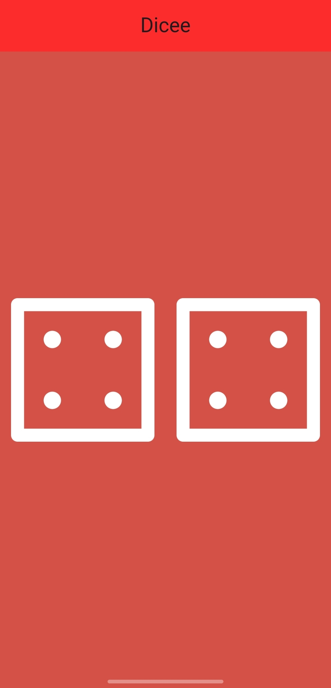

# 🎲 Dicee - Flutter Dice App

A simple, fun dice rolling app built with Flutter. Tap either dice to roll both randomly. A great example of Flutter's `StatefulWidget`, asset management, and user interaction.

---

## 📱 Preview

  
*(Replace with a real screenshot or animation GIF of your app in action)*

---

## ✨ Features

- Two animated dice using images
- Tap either die to roll both
- Random number generation using Dart's `math` library
- Clean and minimalistic UI
- Responsive layout with `Expanded` widgets
- AppBar with centered title

---

## 🛠️ Technologies Used

- **Flutter** (UI Toolkit)
- **Dart** (Programming Language)
- **Material Design** (App structure)
- **Random Number Generator** (Dart’s `Random`)
- **Asset Management** (Local images)

---

## 📂 Project Structure

```bash
dicee_flutter/
├── assets/
│   └── images/
│       ├── dice1.png
│       ├── dice2.png
│       ├── dice3.png
│       ├── dice4.png
│       ├── dice5.png
│       └── dice6.png
│       └── screenshot.png
├── lib/
│   └── main.dart
├── pubspec.yaml
└── README.md
